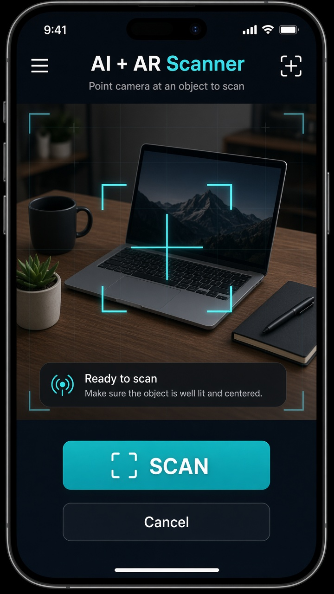
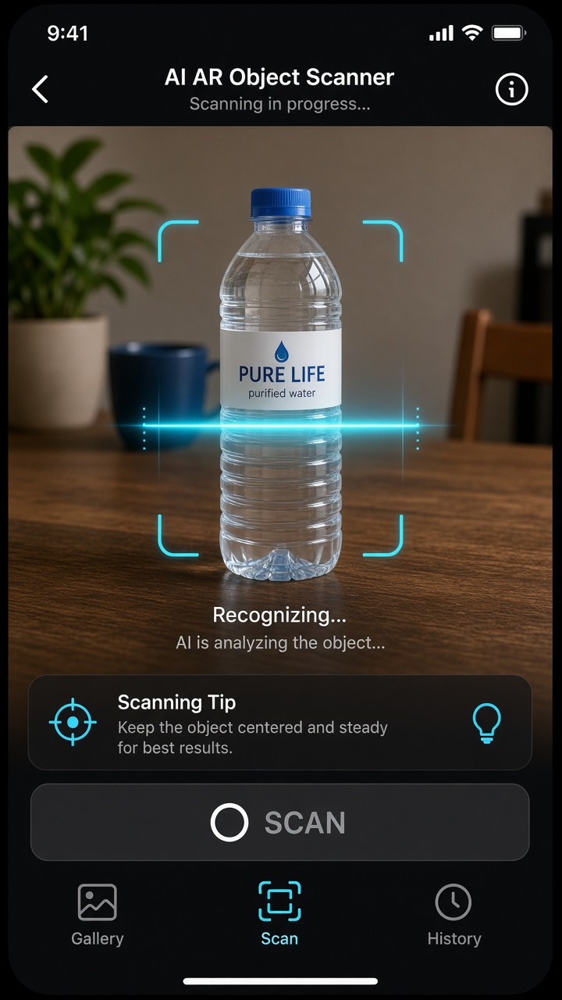
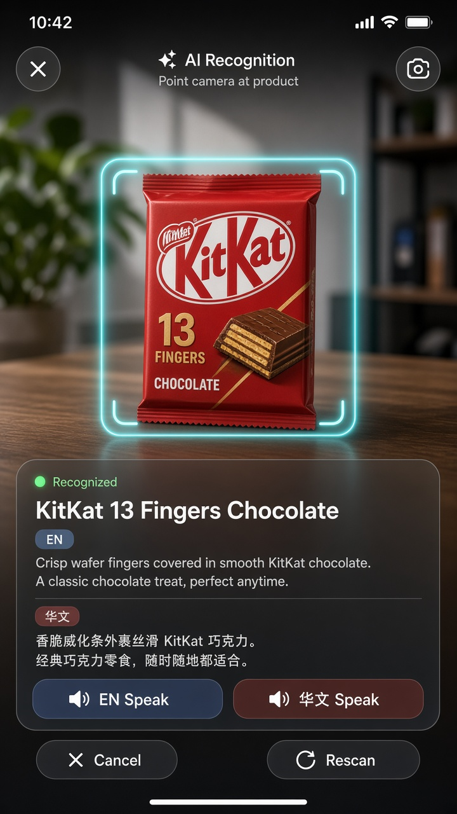
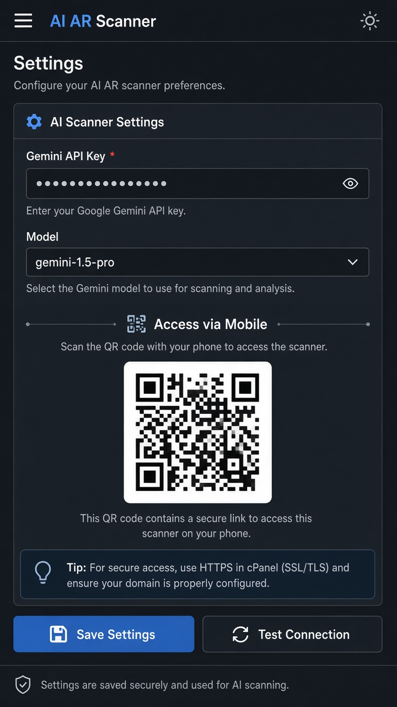
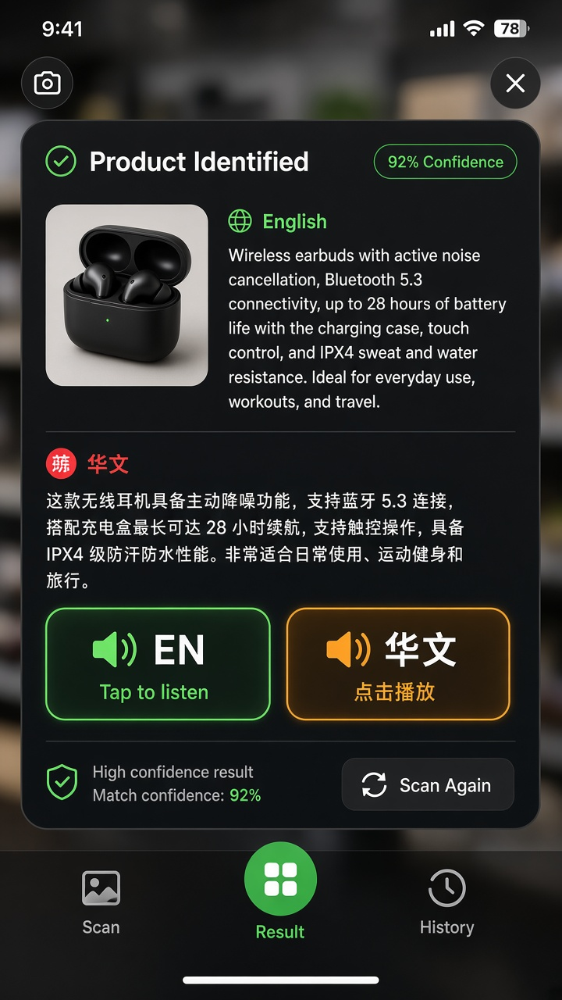
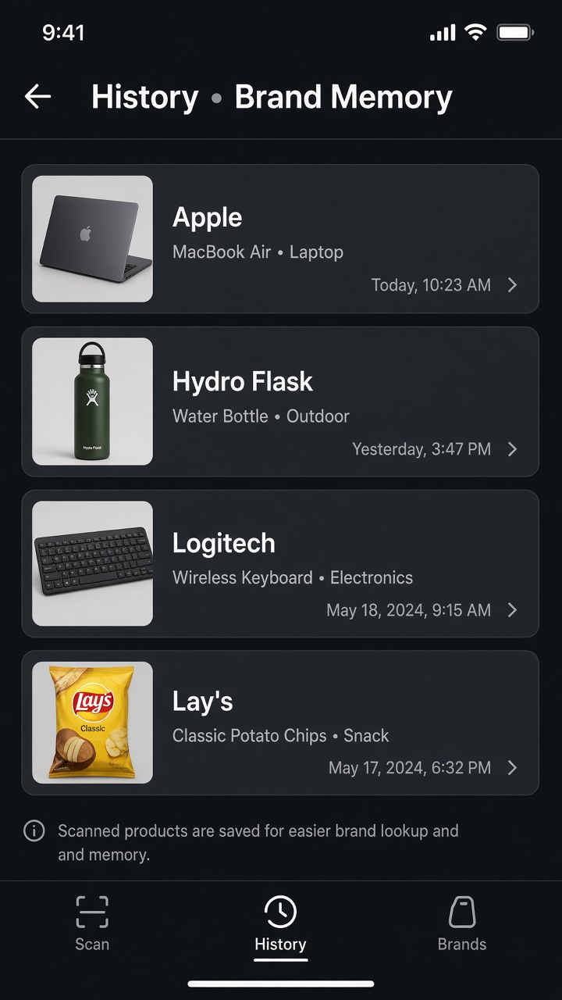

# AI + AR Smart Object Recognition System

Smartphone camera → capture → AI Vision (Gemini / Agnes) → AR bounding box + product overlay.

## Screenshots

| Scanner | Scanning | AR Result |
|:---:|:---:|:---:|
|  |  |  |

| Settings + QR | EN / 华文 Speech | History |
|:---:|:---:|:---:|
|  |  |  |

## 1. Project Overview

A mobile-first web app for XAMPP / cPanel that identifies physical objects with AI Vision and shows an AR-style detection box over the live camera.

## 2. Features

- Live rear-camera scanner UI
- JPEG capture (max 1280px, quality ~0.70)
- Gemini Vision + Agnes Vision providers
- Auto fallback (Gemini → Agnes)
- AR overlay (bounding box + expandable card)
- Settings page with **phone QR code**
- Optional MySQL scan history
- API keys never exposed to the browser

## 3. Technology Stack

PHP 8.3+, MySQL 8+ (optional), HTML5, CSS3, Vanilla JS, Bootstrap 5 (settings), Font Awesome, Google Fonts, PDO, MediaDevices, Canvas, Fetch, JSON.

## 4. Requirements

- XAMPP (Apache + PHP 8.3+, curl enabled) or cPanel PHP hosting
- HTTPS for real phone camera access (or localhost)
- Gemini and/or Agnes API key

## 5. XAMPP Installation

1. Copy folder to `C:\xampp\htdocs\ai-ar-object-recognition\`
2. Start Apache (and MySQL if using history)
3. Copy `config/config.example.php` → `config/config.php` (already created empty keys)
4. Open `http://localhost/ai-ar-object-recognition/settings.php`
5. Paste API keys → Save → Test Connection
6. **Scan the QR code with your phone** to open the scanner

## 6. cPanel Installation

详见 **`CPANEL安装说明.md`**。

快速步骤：

1. 双击 `打包cPanel.zip.bat` 生成 `ai-ar-cpanel.zip`
2. cPanel 文件管理器上传到 `public_html/ai-ar/` 并解压
3. 打开 `https://你的域名.com/ai-ar/settings.php`
4. 填写 Gemini API Key → Save
5. 手机扫二维码使用（需网站已开 HTTPS）

## 7. HTTPS Requirement

Browsers require a **secure context** for camera (HTTPS or localhost).  
LAN `http://192.168.x.x` may be blocked on some phones — use HTTPS tunnel or host online.

## 8. AI API Configuration

In Settings:

| Field | Notes |
|--------|--------|
| Provider | Auto / Gemini / Agnes |
| Gemini key | Google AI Studio key |
| Agnes base + key | OpenAI-compatible vision endpoint |

Keys are stored only in `config/config.php` (blocked by `.htaccess`).

## 9. Database Setup

Optional:

1. Import `database/database.sql` in phpMyAdmin
2. Enable “MySQL scan history” in Settings

## 10. Camera Permission

Phone opens scanner via QR → tap **Allow camera** → point at object → **SCAN**.

## 11. Testing

1. Settings → Test Connection  
2. Phone QR → Allow camera → Scan a laptop/bottle/keyboard  
3. Confirm AR box + product card  
4. Scan Again

## 12. Troubleshooting

| Issue | Fix |
|--------|-----|
| No camera | Use HTTPS / allow permission |
| AI not configured | Add key in Settings |
| Gemini fail | Check model name / quota; try Auto |
| QR opens wrong host | Open Settings from the URL phones can reach |

## 13. Security Notes

- **API keys are never committed** — `config/config.php` is in `.gitignore`
- Clone 后请复制：`config/config.example.php` → `config/config.php`，再在 Settings 填写 Key
- Config directory denied by `.htaccess`
- APIs never return keys to the browser
- AI JSON is validated/normalized before display

## 14. Folder Structure

See repository tree under `ai-ar-object-recognition/` (`index.php`, `settings.php`, `api/`, `includes/`, `assets/`, `config/`, `database/`).

---

### 手机扫码使用（重点）

1. 电脑打开：`http://localhost/ai-ar-object-recognition/settings.php`
2. 用手机扫页面上的 **大二维码**
3. 手机打开扫描页 → 允许相机 → 对准物体点 **SCAN**
